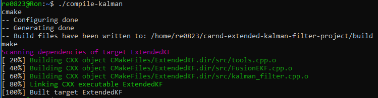
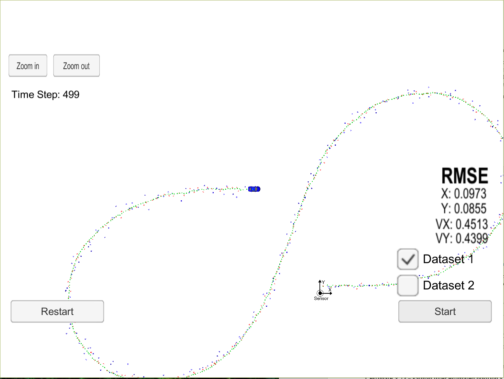
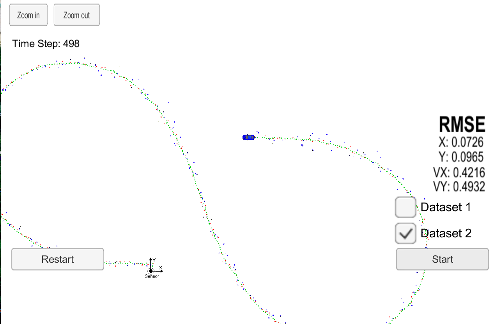
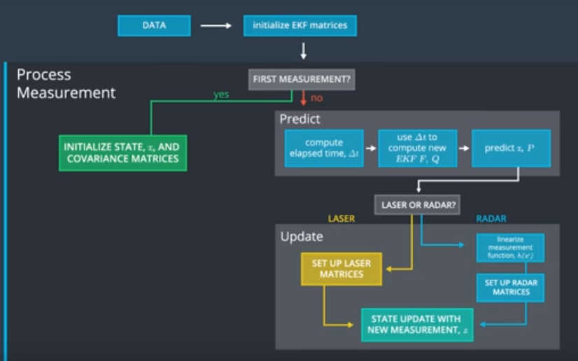

Extended Kalman Filters
=======================

### Introduction

As this was my first serious project in C, I must admit it was daunting.
Thankfully, there are many examples of this project online. In particular, I
found the MyCodeBits project very helpful. I also used Priya Dwivedi’s and
Jeremy Shannon’s project for sanity checking.

### Compiling

#### Code must compile without errors using cmake and make.

My code compiles without errors; however, the [make] utility generates a
significant number of warnings – primarily because the code we are not supposed
to modify was written sloppily. I had to waste hours trying to figure out how to
suppress these superfluous warnings. My solution was to modify the
CMakeLists.txt file this line:

| From:                                | To:                                     |
|--------------------------------------|-----------------------------------------|
| set(CMAKE_CXX_FLAGS "\${CXX_FLAGS}") | set(CMAKE_CXX_FLAGS "\${CXX_FLAGS} -w") |

If this causes issues on other platforms, Udacity has no one to blame itself.
I’m not sure why Udacity chooses not to take the time to fix these issues. After
the above modification, the [cmake] and [make] output looks good:

### Accuracy

**px, py, vx, vy output coordinates must have an RMSE \<= [.11, .11, 0.52, 0.52]
when using the file: "obj_pose-laser-radar-synthetic-input.txt" which is the
same data file the simulator uses for Dataset 1.**

Using Dataset 1, the RMSE is well under the target values for X, Y, VX and VY:

Dataset

Using Dataset 2, the RMSE is also below target:

Dataset

### Follows the Correct Algorithm

**Your Sensor Fusion algorithm follows the general processing flow as taught in
the preceding lessons.**

The preceding lessons were the baseline and foundation for my Sensor Fusion
Algorithm. My coding follows the Sensor Fusion General Flow:

**Your Kalman Filter algorithm handles the first measurements appropriately.**

My algorithm uses the first measurements to initialize the state vectors. Since
the covariance matrix does not require a first measurement for initialization, I
initialized this matrix as part of the FusionEKF function.

**Your Kalman Filter algorithm first predicts then updates.**

Upon receiving a measurement after the first, my algorithm predicts object
position to the current timestep and then updates the prediction using the new
measurement.

#### Your Kalman Filter can handle radar and lidar measurements.

My algorithm sets up the appropriate matrices given the type of measurement and
calls the correct measurement function for a given sensor type.

### Code Efficiency

**Your algorithm should avoid unnecessary calculations.**

I avoided the following:

-   Running the exact same calculation repeatedly when I could run it once,
    store the value and then reuse the value later,

-   Loops that run too many times,

-   Creating unnecessarily complex data structures when simpler structures work
    equivalently,

-   Unnecessary control flow checks.
